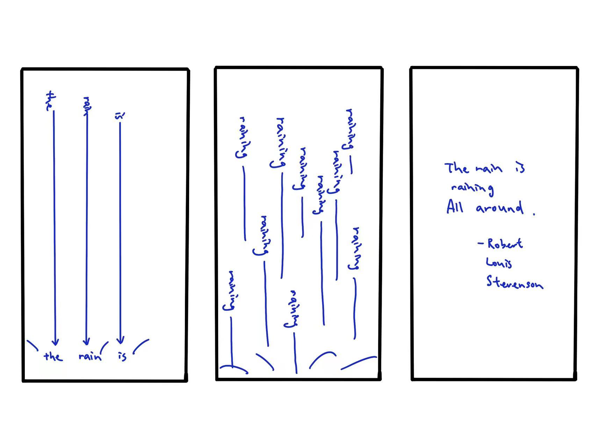

## Text
I chose the text from a poem called *"Rain"* by *Robert Louis Stevenson* who is a Scottish novelist, essayist, poet and travel writer. The whole poem is:
*"The rain is raining all around,*
*It falls on field and tree,*
*It rains on the umbrellas here,*
*And on the ships at sea."*
The poem was published in 1885 as part of his collection of poetry for children called *"A Child's Garden of Verses".*
Since it is a poem that describes rain, I want to make a rain animation which means the text falling form up to down. Here I drew the draft:

## Process
1. I first initialized the animation by creating instances of the TextDrop class for the words "the," "rain," and "is" to slowly fall from the top of the canvas.
2. After all initial words disappear, startRain becomes true, and the animation of the word "raining" begins to fall randomly. 
3. After a specified time (actTime), the code reveals the whole poem with the change of opacity.

## Challenge
I think the most difficult part is that the text characters and words have different animations (falling, rotation, and fading) that must work together seamlessly. Coordinating these animations and ensuring they don't interfere with each other can be challenging. 